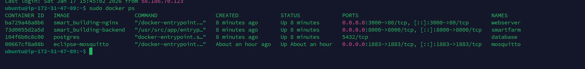

# Hướng dẫn Setup & Deploy Smart Building

Tài liệu này mô tả các bước **setup môi trường (BE & FE)** và **deploy hệ thống** trên server cloud.

---

## Bước 1: Setup môi trường (ENV)

### 1. Backend (BE)

Cấu hình các biến môi trường trong file `.env` cho Backend.

#### Các biến **cố định**

```env
HOST_NAME=my-postgres
POSTGRES_USER=postgres
POSTGRES_PASSWORD=postgres
```

#### Các biến **có thể thay đổi** (tuỳ theo project sử dụng)

```env
POSTGRES_DB=server_version_3
SERVER_BROKER=mosquitto
```

---

### 2. Frontend (FE)

Cấu hình biến môi trường trong file `.env` của Frontend:

```env
REACT_APP_BACKEND_URL=http://54.254.254.15:8000
```

* `54.254.254.15` là **IP public của Backend (thay bằng IP public của thầy)**
* Port Backend mặc định: **8000**

---

## Bước 2: Deploy hệ thống

### 1. Build Frontend (local)

Do tài nguyên cloud có hạn, **Frontend được build sẵn trên máy local**.

```bash
cd frontend/Year3_dev_Frontend/main/react-admin
npm run build
```

Sau khi build xong:

* Commit & **push code lên Git repository**

---

### 2. Clone & chạy project trên server cloud

Truy cập server cloud của thầy bằng:

* SSH terminal, **hoặc**
* Ứng dụng **Termius** (khuyến nghị cho tiện sử dụng)

Clone project về server nếu chưa có:

```bash
git clone <link_repository>
```

Nếu có rồi thì git pull về

Di chuyển vào thư mục project:

```bash
cd Smart_Building
```

Build & chạy Docker containers:

```bash
sudo docker compose up -d --build
```

---

### 3. Restore Database

Copy file backup database vào container database:

```bash
cd Smart_Building
```

```bash
sudo docker cp backup.sql database:/backup.sql
```

Truy cập container database:

```bash
sudo docker ps
```


hiển thị một loạt danh sách container đang chạy

```bash
sudo docker exec -it 'id container cua postgres' bash
```

Đăng nhập PostgreSQL:

```bash
psql -U postgres
```

Xoá và tạo lại database:

```sql
DROP DATABASE IF EXISTS 'tên db trong cấu hình';
CREATE DATABASE 'tên db trong cấu hình';
```

Thoát PostgreSQL:

```bash
exit
```

Restore dữ liệu từ file backup:

```bash
psql -U postgres server_version_3 < /backup.sql
```

---

## Tài khoản đăng nhập mặc định

```text
Username: ipaclab
Password: 123456
```
