# Phần 1: Hướng dẫn Fork Dự Án
Fork một dự án trên GitHub là một cách để sao chép một dự án của người khác về tài khoản của mình có thể tùy ý chỉnh sửa mà không ảnh hưởng đến bản gốc.
## Bước 1: Truy cập Repository
1. Đăng nhập vào tài khoản GitHub.
2. Truy cập vào repository sau [Link đến Repo](https://github.com/NRO2k3/Smart_Building)
## Bước 2: Fork Repository
1. Nhấn vào nút **Fork** ở góc trên bên phải của trang repository
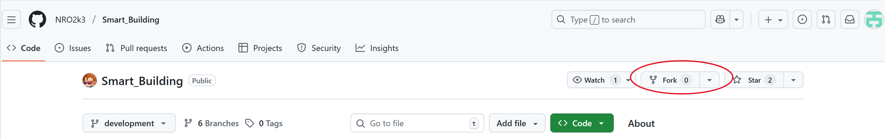
2. Nhấn vào nút **Create Fork**
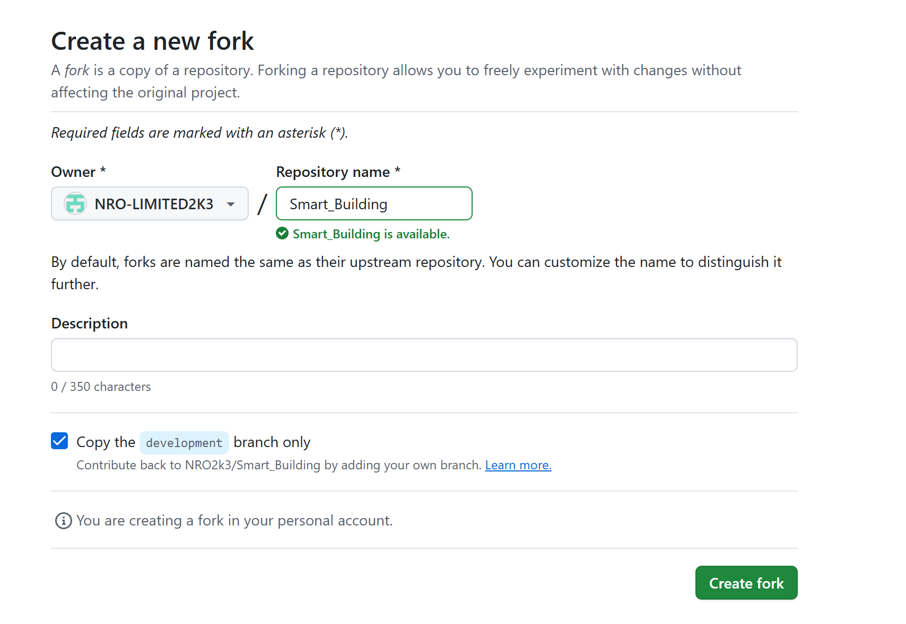
## Bước 3: Clone Repository về Máy Tính
1. Truy cập vào repository đã fork.
2. Nhấn vào nút **Code** và sao chép URL.
3. Mở terminal và chạy lệnh sau để clone repository về máy:
   ```bash
   cd Desktop
   ```
   Chuyển thư mục làm việc hiện tại sang thư mục “Desktop” (Màn hình chính)
   ```bash
   git clone <URL>
   ```
   Thay `<URL>` bằng URL đã sao chép.
   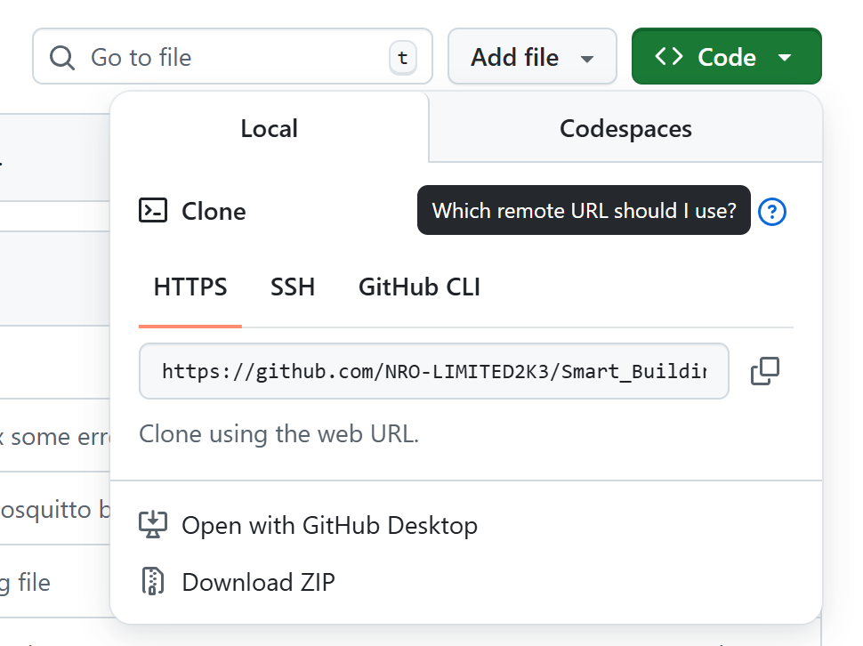
   Ví dụ của anh là **https://github.com/NRO-LIMITED2K3/Smart_Building.git**
   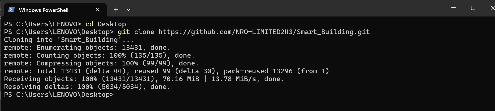
   Màn hình terminal khi chạy xong hai câu lệnh
   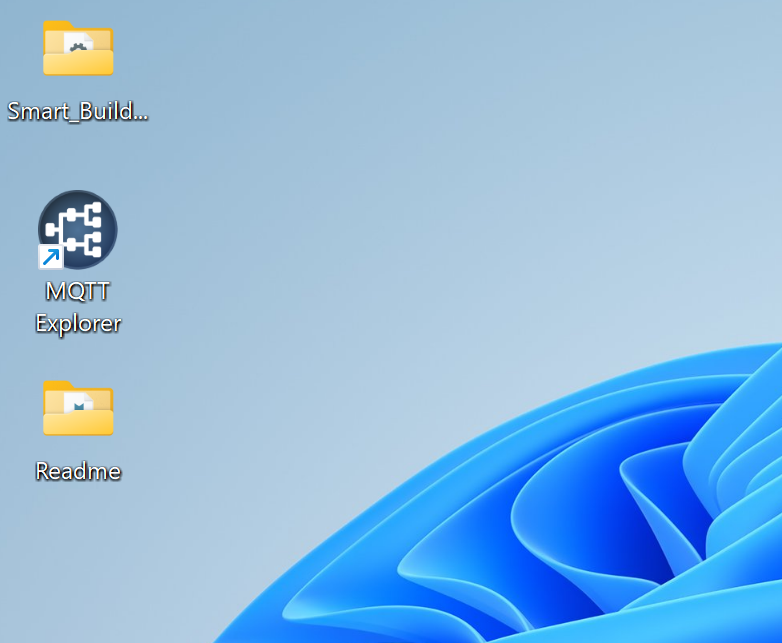
   Màn hình chính đã xuất hiện file SmartBuilding. Từ giờ đã thành của riêng mình thoải mái phát triển.

   Note: Test nhanh để push lên github thử. Nếu bị lỗi permission denied thì là do tài khoản github local đang không đồng bộ với github (chắc không gặp tại anh đang có hai toàn khoản khác nhau).
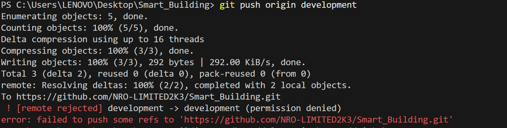
   Để fix vào terminal chạy câu lệnh (nhớ là vào file đấy **cd Desktop/Smart_Building**) và push lại (tiến hành đăng nhập vào tài khoản gốc hoặc tài khoản collaborator mà mình mời tham gia vào dự án) cứ làm theo ảnh bên dưới
   ```bash
   cmdkey /delete:git:https://github.com
   ```
   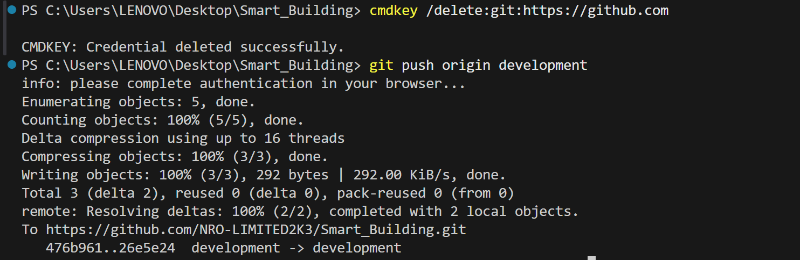

# Phần 2: Các công cụ cần cài đặt
## 1. Cơ sở dữ liệu quan hệ PostgreSQL v18 Windows x86-64	
[Link Dowload](https://www.enterprisedb.com/downloads/postgres-postgresql-downloads)
## 2. API Testing với Postman
[Link Dowload](https://www.postman.com/downloads/)
## 3. Dowload mosquitto
[Link Dowload](https://mosquitto.org/download/)
## 4. MQTT Explorer (nếu dùng):
MQTT Explorer là một công cụ máy khách MQTT mã nguồn mở, cung cấp giao diện đồ họa để kết nối và tương tác với các broker MQTT
[Link Dowload](https://mqtt-explorer.com/)
# Phần 3: Triển khai Local
## Phần Backend
### 1. Cấu hình và cài đặt database trong file .env
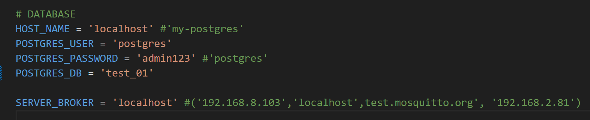
- Triển khai local HOST_NAME = localhost, SERVER_BROKER = localhost (chú ý nếu chạy docker, port broker chạy trong docker mà khác 1883 -ví dụ: ***9001***:1883- cần cấu hình lại port trong code lại trong 2 file mqtt_server_to_gateway.py và mqtt_gateway_to_server)
- POSTGRES_USER và POSTGRES_PASTWORD là tên người dùng và mật khẩu mà mình sử dụng lúc đang cài đặt
- POSTGRES_DB = 'test_01' là tên cơ sở dữ liệu mình dùng để lưu. Ở đây là ví dụ và bắt buộc phải có nếu chưa có vào Database(PgAdmin4) để tạo
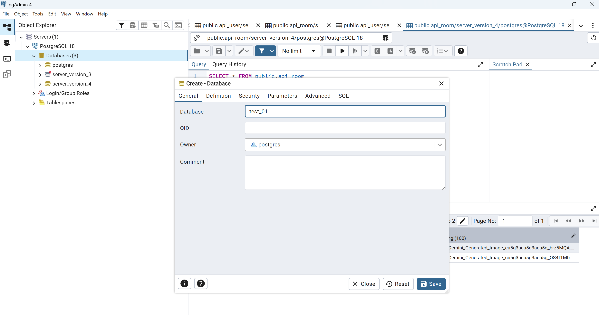
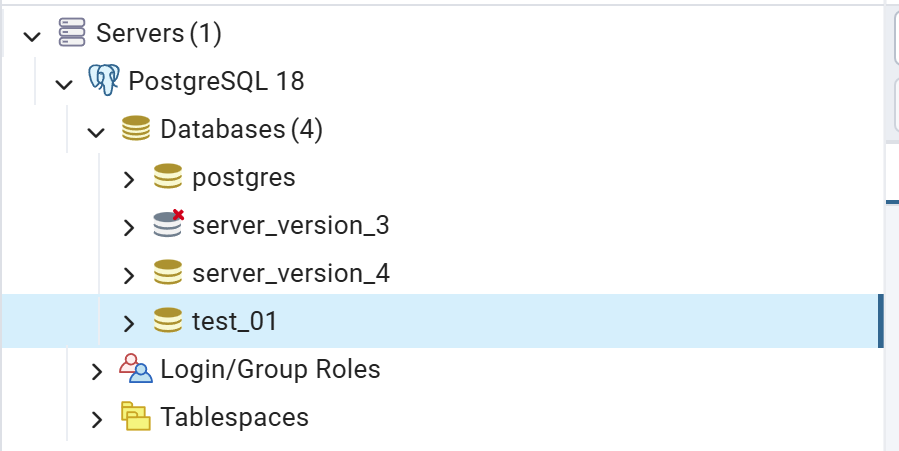
### 2. Cài đặt thư viện
Bước 1: Mở file trong VS code, bật terminal.
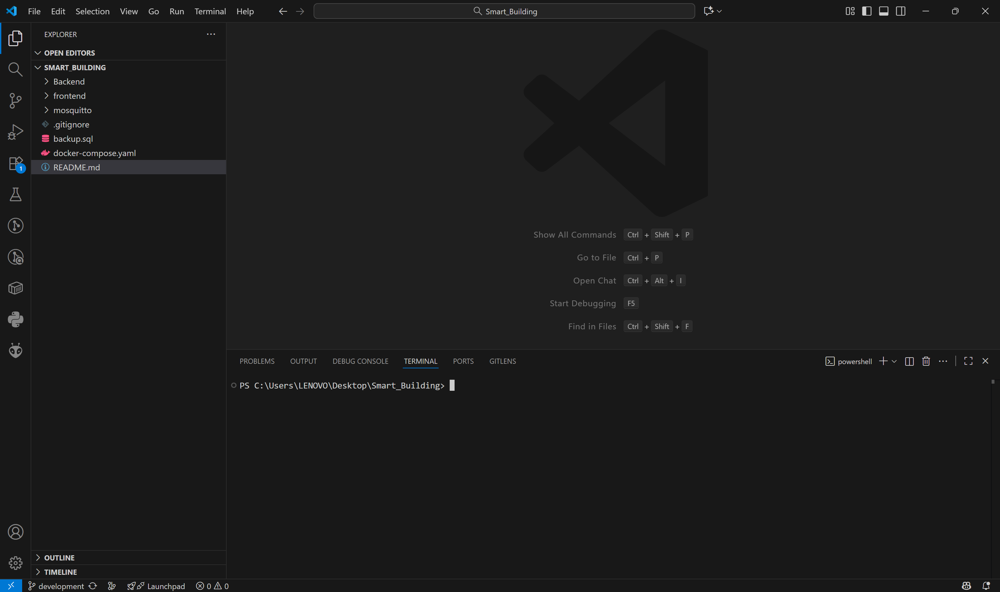
Bước 2: Di chuyển vào thư mục Backend bằng câu lệnh
```bash
cd Backend
```
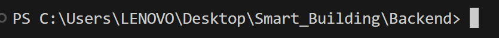
Bước 3: Tạo môi trường ảo
```bash
python -m venv venv
```
Bước 4: Vào môi trường ảo
```bash
venv\Scripts\activate
```
Bước 5: Cài đặt các thư viện cần để server chạy:
```bash
pip install -r requirements.txt
```
Bước 6: Tiến hành migrate các bảng vào database mình cấu hình phía trên:
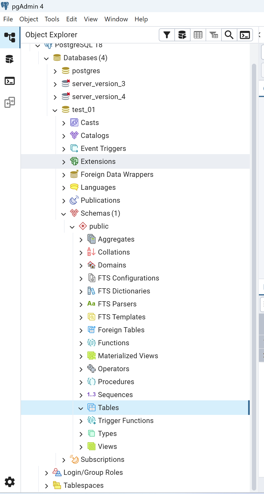
Trên hình hiện danh sách bảng hiện đang không có
```bash
python manage.py makemigrations
python manage.py migrate
```
Sau khi thực hiện câu lệnh xong và refresh lại Table đã thấy xuất hiện danh sách các bảng:
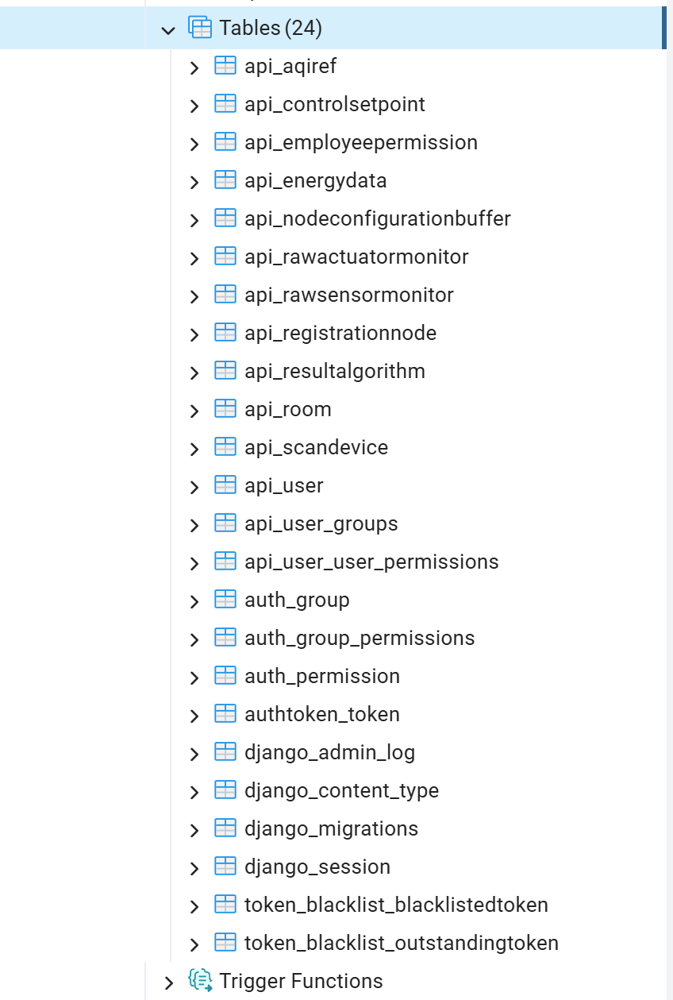
Bước 7: Chạy server
```bash
python manage.py runserver
```
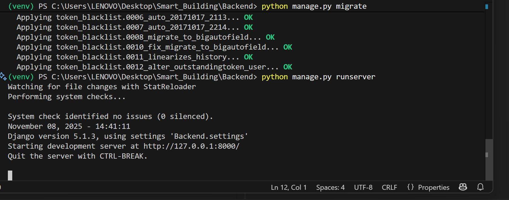
Bước 8: Test thử xem server chạy trả về gì, mở postman chạy thử.
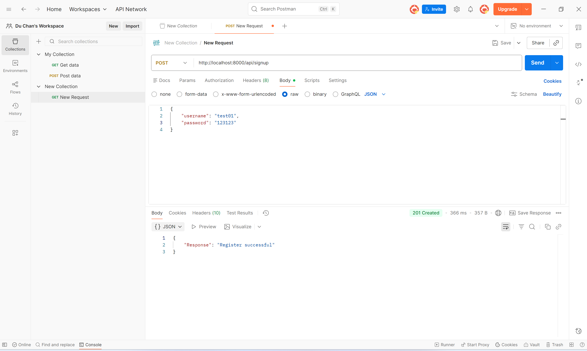
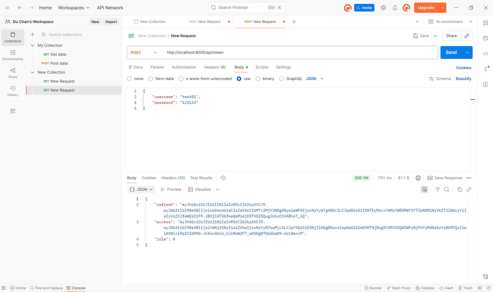
Bước 9: Chạy thêm một background task nhận dữ liệu từ gateway + tự động call dữ liệu từ api thời tiết mở thêm một terminal mới và chạy lệnh sau:
```bash
venv\Scripts\activate
```
Bật môi trường ảo
```bash
cd api
```
Chuyển vào thư mục api
```bash
python mqtt_gateway_to_server.py
```
Chạy file python
# Phần 4: Tích hợp bộ API vào postman
Import 2 file json trong folder **json** vào Postman: import (góc trái màn hình) -> select file
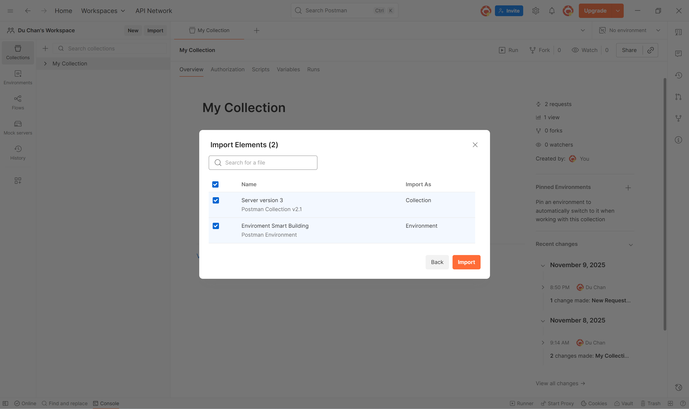
Sau khi import file xong:
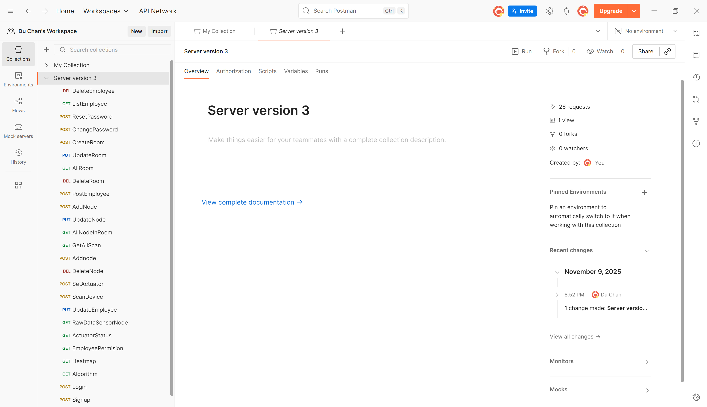
Cấu hình giá trị cho local trong phần enviroment (bên trái màn hình) chọn Enviroment Smart Building bằng **localhost:8000**
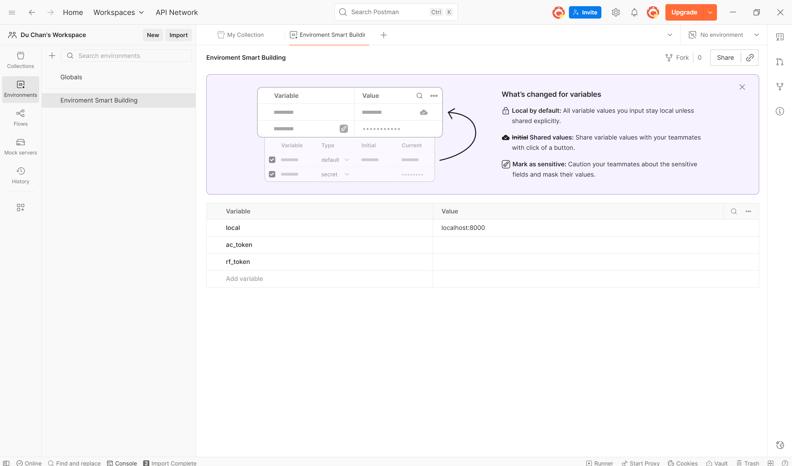
Chọn Collection Server version 3 bên phần bên phải màn mình chuyển No enviroment sang Enviroment Smart Building
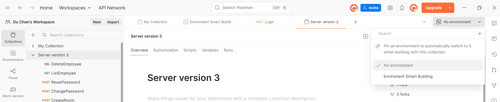
Tiến hành test thử API
# Phần 5: Phần Frontend
```bash
cd frontend\Year3_dev_Frontend\main\react-admin  
npm install --legacy-peer-deps
npm start
```


